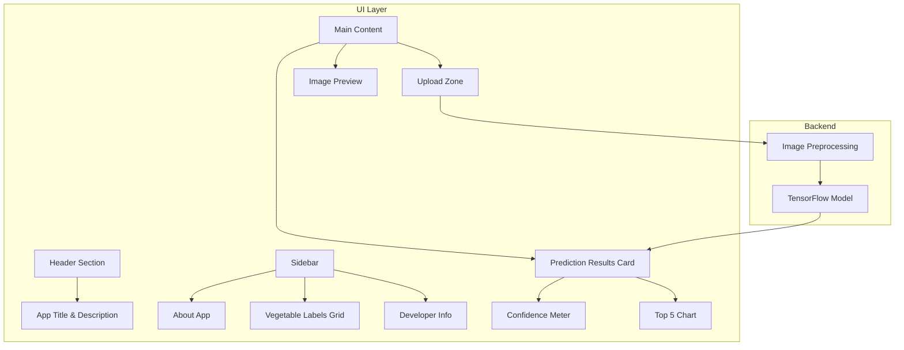

# Design Document

## Overview

Redesign UI aplikasi Vegetable Classifier untuk memberikan pengalaman pengguna yang lebih baik dengan tampilan modern, informatif, dan menarik. Aplikasi menggunakan Streamlit sebagai framework web dengan TensorFlow untuk model klasifikasi CNN.

## Architecture



## Components and Interfaces

### 1. Header Component
- Application title dengan emoji dan gradient text
- Subtitle dengan deskripsi singkat aplikasi
- Badge menunjukkan jumlah sayuran yang dapat dikenali

### 2. Sidebar Component
- **About Section**: Penjelasan tentang aplikasi dan teknologi yang digunakan
- **Vegetable Labels Section**: Grid 3 kolom menampilkan semua 15 sayuran dengan emoji dan nama Indonesia
- **Developer Credits**: Nama developer, versi, dan tanggal update

### 3. Upload Zone Component
- Styled drag-and-drop area dengan border dashed hijau
- Icon upload yang menarik
- Text instruksi yang jelas
- Supported format indicator

### 4. Prediction Results Component
- **Result Card**: Card dengan shadow menampilkan hasil prediksi
- **Vegetable Name**: Nama dalam bahasa Inggris dan Indonesia dengan emoji
- **Confidence Meter**: Progress bar visual dengan warna gradient (merah-kuning-hijau)
- **Top 5 Chart**: Horizontal bar chart untuk 5 prediksi teratas
- **Warning Alert**: Pesan peringatan jika confidence < 70%

## Data Models

### Vegetable Label Mapping
```python
VEGETABLE_DATA = {
    "Bean": {"emoji": "🫘", "indonesian": "Kacang"},
    "Bitter_Gourd": {"emoji": "🥒", "indonesian": "Pare"},
    "Bottle_Gourd": {"emoji": "🍐", "indonesian": "Labu Air"},
    "Brinjal": {"emoji": "🍆", "indonesian": "Terong"},
    "Broccoli": {"emoji": "🥦", "indonesian": "Brokoli"},
    "Cabbage": {"emoji": "🥬", "indonesian": "Kubis"},
    "Capsicum": {"emoji": "🫑", "indonesian": "Paprika"},
    "Carrot": {"emoji": "🥕", "indonesian": "Wortel"},
    "Cauliflower": {"emoji": "🥦", "indonesian": "Kembang Kol"},
    "Cucumber": {"emoji": "🥒", "indonesian": "Mentimun"},
    "Papaya": {"emoji": "🍈", "indonesian": "Pepaya"},
    "Potato": {"emoji": "🥔", "indonesian": "Kentang"},
    "Pumpkin": {"emoji": "🎃", "indonesian": "Labu"},
    "Radish": {"emoji": "🥕", "indonesian": "Lobak"},
    "Tomato": {"emoji": "🍅", "indonesian": "Tomat"}
}
```

### Prediction Result Model
```python
@dataclass
class PredictionResult:
    label: str
    confidence: float
    indonesian_name: str
    emoji: str
    top_5: List[Tuple[str, float]]
    is_low_confidence: bool  # True if confidence < 0.7
```


## Correctness Properties

*A property is a characteristic or behavior that should hold true across all valid executions of a system-essentially, a formal statement about what the system should do. Properties serve as the bridge between human-readable specifications and machine-verifiable correctness guarantees.*

Based on the prework analysis, the following properties are testable:

### Property 1: Vegetable Label Data Completeness
*For any* vegetable label in the VEGETABLE_DATA mapping, the data structure SHALL contain a non-empty emoji string and a non-empty Indonesian translation string.

**Validates: Requirements 2.1, 2.2, 2.3**

### Property 2: Prediction Result Bilingual Display
*For any* valid prediction result with a label that exists in VEGETABLE_DATA, the formatted output SHALL contain both the English label name and the corresponding Indonesian translation.

**Validates: Requirements 4.1**

### Property 3: Top 5 Predictions Consistency
*For any* prediction probability array of length 15, extracting the top 5 predictions SHALL return exactly 5 items sorted in descending order by probability, and the sum of all 5 probabilities SHALL be less than or equal to 1.0.

**Validates: Requirements 4.3**

### Property 4: Low Confidence Warning Threshold
*For any* confidence value, the `is_low_confidence` flag SHALL be True if and only if confidence < 0.7.

**Validates: Requirements 4.4**

## Error Handling

| Error Scenario | Handling Strategy |
|----------------|-------------------|
| Model file not found | Display error message with instructions to check model path |
| Invalid image format | Show supported formats (JPG, JPEG, PNG) and ask user to re-upload |
| Prediction failure | Display friendly error message and suggest trying another image |
| Label not in mapping | Fallback to English label only with generic emoji |

## Testing Strategy

### Unit Testing
- Test VEGETABLE_DATA contains all 15 expected labels
- Test Indonesian translations are non-empty for all labels
- Test emoji mappings exist for all labels
- Test low confidence threshold logic (boundary cases: 0.69, 0.70, 0.71)

### Property-Based Testing
Using `hypothesis` library for Python:

1. **Property 1 Test**: Generate random selections from VEGETABLE_DATA and verify completeness
2. **Property 2 Test**: Generate random valid labels and verify bilingual output
3. **Property 3 Test**: Generate random probability arrays (15 floats summing to 1.0) and verify top-5 extraction
4. **Property 4 Test**: Generate random float values [0.0, 1.0] and verify warning flag logic

### Test Configuration
- Property tests: minimum 100 iterations per property
- Each property test tagged with: `**Feature: ui-improvement, Property {number}: {property_text}**`
